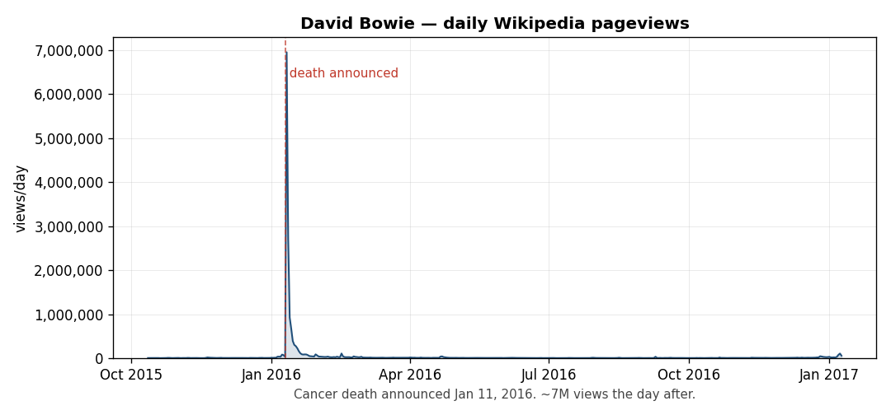
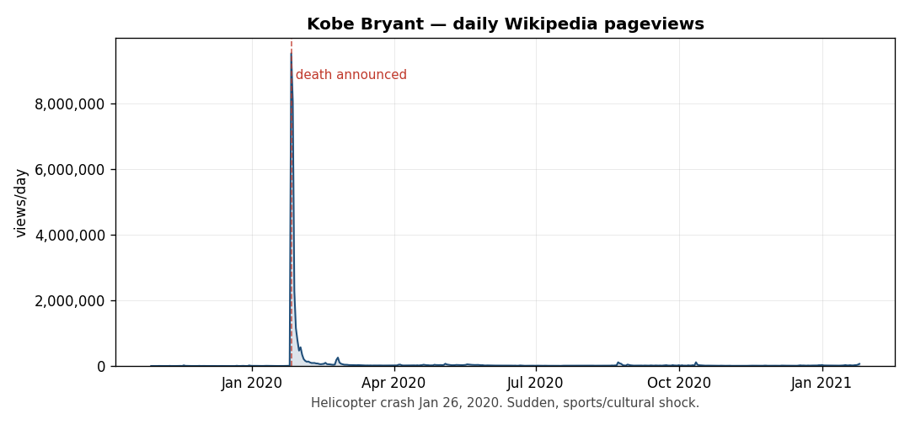
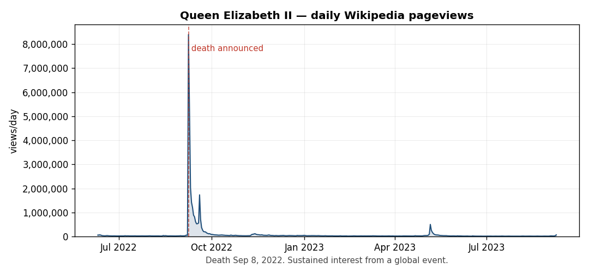
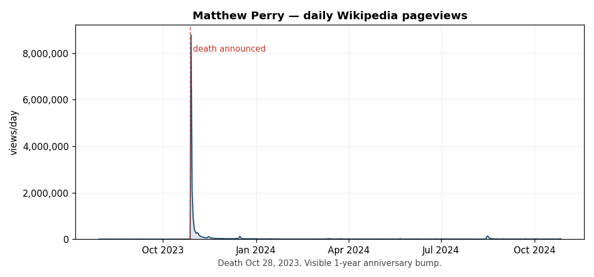

# celeb-data

A dataset for examining how publicly notable celebrity deaths translate into measurable public attention, using Wikipedia pageviews as the attention signal.

The repo holds two parallel tracks:

- **Curated set** — 356 hand-picked notable deaths (2010-2025), drawn from Variety, Hollywood Reporter, AARP, Britannica, CBS/ABC News, NPR, and Wikipedia in-memoriam compilations. Daily pageviews pulled for the 277 that fall within the daily-data era.
- **Full scrape** — every death recorded on Wikipedia's "Deaths in [year]" pages for 2015-2025 (**98,616 entries**), each scored with a Wikidata `sitelink_count` notability proxy. Daily pageviews pulled for the **4,840** most notable (sitelink ≥ 20).

Daily pageview data begins **2015-07-01** (the Wikimedia Pageviews API floor). Each death gets a window of **−90 to +365 days** around it. The curated set additionally carries a Google Trends interest signal.

---

## Files

### Curated set

| File | Description |
|---|---|
| `celebrity-deaths-2010-2025.md` | Human-readable list, organized chronologically by year |
| `celebrity-deaths-2010-2025.csv` | 356 curated deaths with Wikipedia links, DOB, and age at death |
| `pageviews.csv` | Long-format daily Wikipedia pageviews — 124,798 rows covering 277 curated celebrities |
| `pageviews_log.csv` | One row per pageview fetch attempt with status, date range, and any errors |
| `gtrends_cache.csv` | Long-format daily Google Trends interest, −30 to +100 days around each death |
| `plots/` | PNG line plots for the celebrities shown below |

### Full scrape

| File | Description |
|---|---|
| `deaths_2015_2025_scrape.csv` | All 98,616 Wikipedia-recorded deaths, 2015-2025, with `qid` + `sitelink_count` |
| `wikidata_bio.csv` | Wikidata biographical fields (gender, citizenship, occupation, cause of death) for the `sitelink_count` ≥ 20 celebrities |
| `qid_cache.json` | Cache of `wikipedia_title` → Wikidata Q-ID, built while computing sitelink counts |

> **`pageviews_sitelink20.csv`** — long-format daily pageviews, 2,173,807 rows covering the 4,840 deaths with `sitelink_count` ≥ 20 — is **127 MB, over GitHub's 100 MB file limit**, so it ships as a [Release asset](https://github.com/fadilf/celeb-data/releases/latest) rather than in the git tree. The analysis notebooks expect it in the repo root after download.

---

## CSV schemas

**`celebrity-deaths-2010-2025.csv`** — curated deaths

| Column | Notes |
|---|---|
| `date` | YYYY-MM-DD — date the death was publicized (not always the date of death; see Methodology) |
| `name` | Display name |
| `description` | Role / claim to fame |
| `wikipedia_title` | Article slug with underscores |
| `wikipedia_url` | Full Wikipedia URL (percent-encoded) |
| `date_of_birth` | YYYY-MM-DD, from Wikidata |
| `age_at_death` | Integer, computed from Wikidata DOB and DOD |
| `note` | Caveats — populated for 6 entries where the date or article isn't strictly biographical |

**`deaths_2015_2025_scrape.csv`** — full scrape

| Column | Notes |
|---|---|
| `date` | YYYY-MM-DD date of death |
| `name` | Display name |
| `wikipedia_title` | Article slug |
| `age` | Age at death as recorded on Wikipedia's deaths list |
| `description` | Short description from Wikipedia's deaths list |
| `qid` | Wikidata Q-ID (blank for 21 unresolved rows) |
| `sitelink_count` | Number of Wikidata sitelinks — a language-neutral notability proxy |

**`pageviews.csv`** and **`pageviews_sitelink20.csv`** — identical schema, union-compatible

| Column | Notes |
|---|---|
| `name` | Display name |
| `wikipedia_title` | Article slug — join key back to the deaths files |
| `death_date` | YYYY-MM-DD |
| `view_date` | YYYY-MM-DD |
| `days_from_death` | Integer; negative is pre-death, 0 is the anchor day, positive is post |
| `views` | Daily pageview count, `agent=user` (bots/spiders excluded) |

Note on `days_from_death = 0`: in `pageviews.csv` it is the **publicization** date; in `pageviews_sitelink20.csv` it is the **date of death** as recorded by Wikipedia's scrape. For the vast majority these coincide.

**`gtrends_cache.csv`** — Google Trends interest for the curated set

| Column | Notes |
|---|---|
| `name` | Display name — join key to the curated deaths CSV |
| `death_date` | YYYY-MM-DD |
| `view_date` | YYYY-MM-DD |
| `days_from_death` | Integer; window runs −30 to +100 days around the death |
| `interest` | Google Trends relative search interest, 0–100, scaled within each query cohort |

**`wikidata_bio.csv`** — Wikidata biography for the `sitelink_count` ≥ 20 celebrities

| Column | Notes |
|---|---|
| `qid` | Wikidata Q-ID — join key to `deaths_2015_2025_scrape.csv` |
| `gender` | Wikidata P21; pipe-joined if multi-valued |
| `citizenship` | Wikidata P27; pipe-joined if multi-valued |
| `occupation` | Wikidata P106; pipe-joined if multi-valued |
| `cause_of_death` | Wikidata P509; pipe-joined if multi-valued; often blank |

---

## Methodology

**Anchor date.** Curated-set pageview windows are anchored to the date the death was **made public**, not the (sometimes earlier) date of death. For most celebrities these coincide; for six entries they don't and the `note` column flags it:

- Kim Jong-il — announced Dec 19, 2011; died Dec 17
- Steve Ditko — body found Jun 29, 2018; died ~Jun 27
- Florian Schneider — announced May 6, 2020; died Apr 21
- Roy Horn — May 8, 2020; article is the duo Siegfried & Roy, not Roy alone
- Akira Toriyama — announced Mar 8, 2024; died Mar 1
- Gene Hackman — body found Feb 26, 2025; estimated death ~Feb 18

**Window.** Each death gets up to 456 days of pageview data:
- **−90 days** of pre-death baseline (longer than a typical news cycle, so day-to-day noise smooths out)
- **+365 days** of post-death data (captures the spike, the decay, the long-tail return toward baseline, and any 1-year anniversary bump)

Windows are truncated where they'd run past the 2015-07-01 data floor or past the present day.

**Filter.** `agent=user` excludes crawlers and known bot traffic. `access=all-access` aggregates desktop + mobile-web + mobile-app views.

**Notability proxy (`sitelink_count`).** For the full scrape, each title is resolved to a Wikidata Q-ID (MediaWiki `pageprops`), and the entity's sitelink count is read from Wikidata (`wikibase:sitelinks`). Sitelinks count how many language Wikipedias and sister projects link to the entity — a language-neutral fame measure that is cheap to acquire for all 98k rows. Distribution across the scrape:

| Threshold | Deaths | Share |
|---|---|---|
| ≥ 5 | 42,947 | 43.6% |
| ≥ 10 | 17,344 | 17.6% |
| ≥ 20 | 5,084 | 5.2% |
| ≥ 50 | 682 | 0.7% |
| ≥ 100 | 78 | 0.1% |

Median is 4; max is 253 (Queen Elizabeth II). Pageviews were pulled at the **≥ 20** cut — roughly the top 5%, the "celebrity-scale" slice.

**Title resolution.** All 356 curated-set Wikipedia titles are verified to resolve exactly via the MediaWiki API — no redirects, no missing pages.

---

## Caveats

- **Pre-2015 deaths have no daily pageview data.** The Pageviews API begins 2015-07-01. 79 curated entries (2010 through mid-2015) are in the deaths CSV but absent from `pageviews.csv`; 222 scrape entries from early 2015 are likewise excluded from `pageviews_sitelink20.csv`. The legacy `pagecounts-raw` dumps go back to 2007 but use a different format and methodology.
- **English-Wikipedia bias.** Pageviews are pulled from `en.wikipedia` only. For non-English celebrities (Pelé, Akira Toriyama, Sridevi, Mikhail Gorbachev, Pope Francis, Karl Lagerfeld, Alain Delon, etc.) this under-counts global attention. `sitelink_count` does not have this bias.
- **`sitelink_count` measures documented notability, not attention.** It reflects how broadly an entity is covered across language editions — a fame proxy, not a measure of interest in the death itself. Pageviews are the attention signal.
- **Scrape artifacts.** 21 rows in `deaths_2015_2025_scrape.csv` have no `qid` — mostly titles with unrendered MediaWiki template markup (`{{okina}}`, `{{fakau'a}}` — glottal-stop characters in Hawaiian/Tongan names) that don't resolve to Wikidata.
- **Selection bias (curated set).** The 356-name list leans toward U.S./U.K. mainstream culture and is not exhaustive. "Notable" is subjective.
- **Article-level vs person-level.** For Roy Horn the article is the duo Siegfried & Roy; pageviews aren't cleanly attributable to one person.

---

## Examples

Four illustrative pageview curves, hand-picked for the variety of profiles they show.

### David Bowie (Jan 11, 2016) — the canonical massive spike

Cancer death announced Jan 11, 2016. ~6.95M views the day after — one of the largest single-day pageview events in Wikipedia history. Decay is sharp: views are below 10% of peak within a week.

### Kobe Bryant (Jan 26, 2020) — sudden, sports/cultural shock

Helicopter crash on the day of death itself. Peak of ~9.5M views on the death day (no announcement lag — news broke within minutes). Pre-death baseline is meaningfully non-zero given his ongoing public presence.

### Queen Elizabeth II (Sep 8, 2022) — sustained global event

Sustained elevated views for weeks rather than the sharp Bowie-style decay, reflecting the funeral cycle, succession coverage, and tourism around the event.

### Matthew Perry (Oct 28, 2023) — recent death with anniversary bump

Death-day peak of ~8.8M. The smaller bump visible roughly a year later is the anniversary-of-death revival of interest — a pattern visible (though smaller) in many of the celebrities in this dataset once you know to look for it.

---

## Code

**Pipeline scripts.** Each is a standalone [PEP 723](https://peps.python.org/pep-0723/) script — run with `uv run <script>.py`, no project setup needed. They are checkpointed and safe to re-run.

| Script | Does |
|---|---|
| `scrape_deaths.py` | Scrapes Wikipedia "Deaths in [month] [year]" pages → `deaths_2015_2025_scrape.csv` |
| `add_sitelinks.py` | Resolves each title to a Wikidata Q-ID and adds `qid` + `sitelink_count` columns in place |
| `add_bio.py` | Pulls Wikidata biographical fields for the notable slice → `wikidata_bio.csv` |
| `fetch_gtrends.py` | Pulls Google Trends daily interest for the curated set → `gtrends_cache.csv` |

The Wikimedia Pageviews fetch that produced `pageviews.csv` and `pageviews_sitelink20.csv` is not included; those datasets are provided as-is.

**Notebooks.** Three [marimo](https://marimo.io) notebooks — run with `marimo edit <notebook>.py`, or `uv sync` then `marimo edit`. All three read `pageviews_sitelink20.csv`, so download the [Release asset](https://github.com/fadilf/celeb-data/releases/latest) into the repo root first.

| Notebook | Focus |
|---|---|
| `notebook.py` | Overview — age, half-life, peak views vs. notability, decay metrics |
| `mean_residence_analysis.py` | Mean residence time of post-peak attention |
| `attention_dwell_time.py` | Attention as a survival curve — how long attention payers dwell |

---

## Data sources

- **Pageviews** — Wikimedia REST API (`wikimedia.org/api/rest_v1/metrics/pageviews/per-article/...`). Free, no API key, daily granularity from 2015-07-01.
- **Sitelink counts** — Wikidata Query Service (`wikibase:sitelinks`), with titles resolved to Q-IDs via the MediaWiki `pageprops` API.
- **Biographical fields** — Wikidata: DOB / age (P569, P570), gender (P21), citizenship (P27), occupation (P106), cause of death (P509).
- **Search interest** — Google Trends, via the `pytrends` client, daily granularity.
- **Death lists** — Wikipedia "Deaths in [year]" pages (full scrape) and major in-memoriam compilations (curated set).
